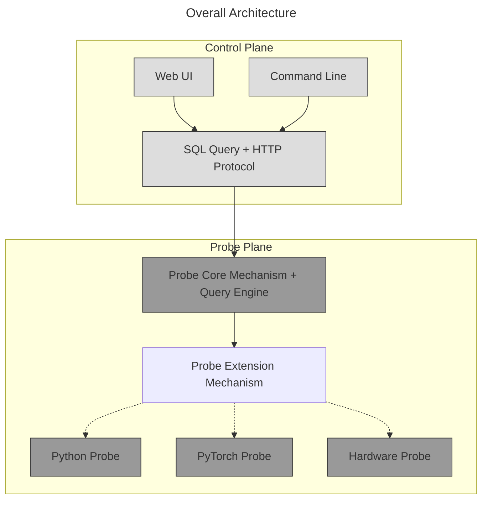
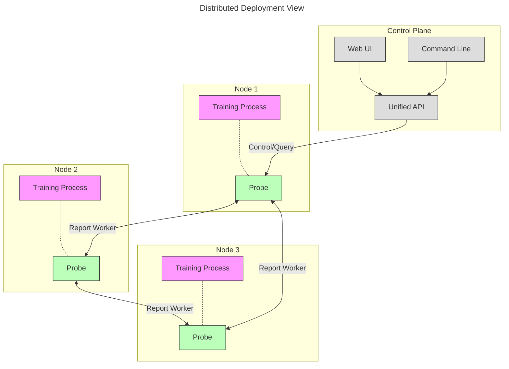

# Challenges in Large-Scale Distributed Heterogeneous Training

Current top-tier LLM training has entered the era of tens of thousands of GPUs. Even DeepSeek, which is most cost-effective in computing, uses 2000 H100s, equivalent to 5000+ A100 FP16 computing power. However, the performance diagnosis system severely lags behind the expansion of computing scale, mainly reflected in the following three aspects:

* **GPU Failures are Normal**: In Meta's LLaMA3 training[^1], 16,000 H100s experienced 466 failures in 54 days, with 58.2% originating from GPU hardware failures. This means facing 8 GPU failures per day, severely affecting training continuity and stability.

* **Performance Below Expectations is Also a Failure**: Due to using large-scale collective communication semantics (such as All Reduce) for synchronous training, slow nodes cause overall system efficiency degradation. In ByteDance's MegaScale actual measurement[^2], removing slow nodes can bring 0.7% MFU improvement. LLaMA-3 training also mentions that locating such slow node problems is extremely difficult.

* **Disconnection Between Hardware, System, and Model Optimization**: Diagnostic data at the chip level is not effectively utilized by systems and models. Currently, systems and models only focus on computing utilization MFU, while memory bandwidth utilization MBU, C2C interconnect bandwidth, and network bandwidth utilization lack attention, preventing hardware, system, and model optimization from forming synergy.

From the above challenges, it can be seen that existing tools have inherent limitations when dealing with large-scale distributed environments, making it difficult to simultaneously meet real-time performance monitoring and fine-grained data collection requirements.

## Existing Tools and Methods Struggle with These Challenges

Existing diagnostic tools mostly focus on a single dimension, making it difficult to achieve comprehensive analysis across hardware failures, system communication, and model performance, and lack visualization and real-time monitoring capabilities for distributed environments. This greatly increases diagnosis costs and time for R&D teams. Specific shortcomings include:

* **Pre-deployment Tool Limitations**: Existing tools require pre-deployment and instrumentation before problems occur, otherwise they cannot capture fault information during or after the event. Many failures and performance issues are usually exposed during or after training, making effective retrospective analysis impossible.

* **High Performance Overhead**: These tools consume large amounts of GPU resources and communication bandwidth during capture and diagnosis, significantly impacting production task performance, making it difficult to deploy them permanently in real production environments.

* **Single-Machine Focus, Lack of Distributed Capabilities**: Most diagnostic tools currently only focus on single-node or single-GPU data, lacking comprehensive analysis capabilities for cross-node communication, load balancing, and other distributed training scenarios, making it difficult to locate system-wide performance bottlenecks.

> To break through the above limitations, we need a diagnostic tool that has both low intrusiveness and real-time monitoring capabilities, and can achieve end-to-end data collection and correlation analysis in distributed scenarios.

## What Characteristics Should an Ideal Diagnostic Tool Have

* **24/7 Availability**
  Can be dynamically enabled at any time without pre-deployment or instrumentation, running continuously in production tasks with extremely low performance overhead, achieving real-time monitoring and fault tracing, helping engineering teams respond to system anomalies and hardware failures in a timely manner.

* **Full Scenario Coverage**
  Not only supports single-machine diagnosis but also seamlessly covers distributed training environments. Regardless of cluster scale, ensures consistency in data collection and fault analysis, meeting needs from small-scale R&D to large-scale production.

* **End-to-End**
  Achieves comprehensive collection of diagnostic data from hardware level, chip interconnect status, to framework, system, and model layer data, building a complete closed-loop monitoring system, thereby providing critical feedback data for hardware chip companies to optimize product design and performance.

# A Distributed Probe System - Probing

Probing provides the following technical solutions for the above problems:

+ **Probe Mechanism**
  Uses ptrace (Linux only) to inject probes into target processes, thereby gaining the same memory address space and permissions as the target process. The probe is implemented as a shared library (libprobing.so) that is dynamically loaded into the target process. This solution allows direct observation and debugging within the process, surpassing the monitoring capabilities of traditional out-of-process tools. It's worth noting that when no monitoring commands are issued, probes are in a completely silent state and do not introduce additional performance overhead.

+ **Query Engine**
  Uses standard SQL engine for data management and analysis. For numerical sequences and string sequences, the Query engine uses different compression encoding algorithms, utilizing data locality for compression. Data compression ratio varies depending on specific data, achieving 5x to hundreds of times compression, significantly reducing storage overhead while ensuring time-series data precision.

+ **Distributed Data Processing**
  Currently, each node runs an independent query engine that processes local data. The cluster API allows querying node information and status across the distributed system. The control plane can manage any process individually and query cluster information through the cluster management interface.
  
  **Future Roadmap - Distributed SQL Query**: Probing is planning to implement distributed SQL query capabilities that will automatically split data computation tasks into local aggregation computation within each node and cross-node data aggregation analysis. This will enable unified SQL queries across the entire distributed system, allowing users to write a single SQL statement that transparently aggregates data from all nodes, achieving efficient monitoring and diagnosis in large-scale distributed environments without manual result merging.

For the two key issues of distribution and heterogeneous computing, Probing makes special optimizations:

- **Distributed**
  - Distributed training state awareness: Real-time monitoring of computation and communication status of each node, supporting automatic discovery of performance anomaly nodes.
  - Collective communication performance optimization: Provides specialized performance analysis tools for common distributed training patterns (DP/TP/PP).
  - Load balancing analysis: Tracks and records load distribution of each node, timely discovering performance bottlenecks during training.
  - **Distributed SQL Query (Planned)**: Future support for transparent cross-node SQL queries that automatically aggregate data from all nodes in the cluster, enabling unified analysis without manual result merging.

- **Heterogeneous Computing**
  - End-to-end data collection: Unified collection of performance metrics from hardware to framework layers, supporting correlation analysis.
  - Hardware performance optimization: Provides data support for hardware performance tuning by analyzing training workload characteristics.

## Overall Architecture



Probing uses a simple and reliable two-layer design:
1. **Probe Plane**, implemented as a shared library (libprobing.so), injected into training processes, providing:
   1. Core mechanism: Implements data collection and code injection via ptrace (Linux only).
   2. Query engine: Built on DataFusion, provides data storage and SQL analysis capabilities.
   3. Extension mechanism: Provides mechanisms for extending probe capabilities based on Python and Rust, while providing Python, Torch, and hardware probe functionality.
   4. HTTP server: Embedded HTTP server (using Axum) that listens on Unix domain sockets (local) or TCP ports (remote) for control commands.
2. **Control Plane**, provides user interaction interfaces, including:
   1. Web interface: Visual operations and data display (Dioxus-based web UI).
   2. Command-line tools: Flexible probe control via HTTP protocol.
   3. HTTP API: Standardized HTTP interface for query execution, configuration, and control.

In distributed scenarios, each process on each node has an independent probe. Probes report their status to a central coordinator (typically rank 0) via a report worker that periodically sends node information. The control plane can manage any process individually, or query cluster information through the cluster API. Node discovery is based on environment variables (MASTER_ADDR, RANK, etc.) and periodic reporting rather than automatic peer discovery.



## Query Engine

Introducing a query engine can greatly simplify the design of data storage and processing modules within probes. The query processing flow inside the query engine is shown below:


Where:
1. Query Language is the query language written by users, generally SQL or DataFrame API.
2. Logical Plan describes the high-level structure of queries and required logical operations, not concerned with low-level execution details.
3. Physical Plan: Specific execution plan generated based on logical plan, containing low-level execution details such as data distribution and operator implementation.
4. Data Sources: Are data sources, any Query will be converted to operations on data sources.

The entire processing flow uses the open-source query engine DataFusion (version 47.0.0). Probing extends DataFusion by implementing custom data source providers that expose probe-collected data as queryable tables. Data sources are organized in three levels:
```
Catalog (Namespace)
   |
   +-- Schema1 (Logical Grouping)
   |     |
   |     +-- Table1
   |     +-- Table2
   |
   +-- Schema2
         |
         +-- Table3
```

**Current Implementation**: Each probe runs an independent DataFusion query engine that processes queries against local data sources. Queries are executed on individual nodes, and results can be aggregated manually through the control plane.

**Future Roadmap - Distributed SQL Query**: Probing plans to extend the query engine with distributed query capabilities, enabling:
- Automatic query planning that splits SQL queries into local and distributed components
- Local aggregation computation within each node to minimize data transfer
- Cross-node data aggregation and result merging
- Transparent distributed query execution from a single SQL statement
- Optimized data locality-aware query routing to reduce network overhead

This will allow users to write queries like `SELECT AVG(cpu_usage) FROM python.metrics GROUP BY node_id` that automatically aggregate metrics across all nodes in the cluster.

## Extension Mechanism

Probing supports two types of data source plugins for static and dynamic data scenarios:

##### TablePlugin
Static table data source plugin for providing single data tables with fixed structure. Suitable for:
- Hardware performance metrics (CPU/GPU utilization, temperature, etc.)
- Process status monitoring (memory usage, thread count, etc.)
- Fixed-format performance counter data

##### SchemaPlugin
Dynamic table data source plugin supporting on-demand creation of multiple data tables. Suitable for:
- File system monitoring (each file mapped as a table)
- Python module tracking (each module mapped as a table)
- Dynamically generated performance analysis data

In addition to the above two extension mechanisms, Probing also provides mechanisms for extending the query engine using Python:

##### Immediate Query

Any Python package function can be treated as a query engine extension, just write it in SQL statements as follows:
```SQL
-- Directly execute Python expression
SELECT *
FROM python.`<Python statement>`
```
For example:
```SQL
SELECT *
FROM python.`time.time()`
```
Will call the `time.time()` statement on the node and return the result as a table.

##### Table Registration

Users can also actively write data to Probing in code:
```python
import probing

# Create and register table
tbl = probing.ExternalTable("test", ["col1", "col2"])

# Write data
tbl.append([1, 0.1])
tbl.append([2, 0.2])
tbl.append([3, 0.3])
```
Data written from Python is also automatically compressed and optimized by the query engine.
```SQL
-- Query registered table
SELECT *
FROM python.test
```

## Comparison with Other Tools

| Feature Dimension | NVIDIA DCGM | Nsight Systems | Torch Profiler | **Probing** |
|------------------|-------------|----------------|----------------|-------------|
| **Intrusiveness** | None (driver level) | Low (requires pre-injection) | High (code modification) | **Very Low (dynamic injection)** |
| **Performance Overhead** | None | Dynamic (varies with sampling frequency) | High | **Dynamic (varies with sampling frequency)** |
| **Distributed Correlation Analysis** | ❌ Single node | ❌ Single process | ❌ Single process | **Distributed Query** |
| **Data Collection Dimension** | Hardware metrics | System + Application layer | Framework layer | **End-to-End (Hardware/Framework/Model)** |
| **Dynamic Start/Stop Capability** | ❌ Always-on collection | ❌ Requires restart | ❌ Code modification | **Runtime Injection🚀** |
| **Fault Diagnosis Capability** | Hardware fault alerts | Performance bottleneck location | Operator performance analysis | **Hardware→Model Correlation Analysis🔍** |
| **Slow Node Detection** | ❌ | ❌ | ❌ | **Auto Tagging🏷️** |
| **Communication Performance Analysis** | Bandwidth utilization | NCCL event tracking | None | **Communication + Model Analysis📊** |
| **Memory Diagnosis** | GPU memory usage | GPU memory access patterns | GPU memory allocation statistics | Under development |
| **Data Retrospection Capability** | Rolling window storage | Requires file export (large files) | Requires file export (large files) | **Dynamic Storage📦** |
| **Hardware Feedback Value** | Basic health monitoring | Microarchitecture optimization | None | **Workload-Guided Chip Design💎** |

# References

[^1]: [The Llama 3 Herd of Models](https://arxiv.org/pdf/2407.21783)

[^2]: [MegaScale: Scaling Large Language Model Training to More Than 10, 000 GPUs](https://arxiv.org/pdf/2402.15627)
