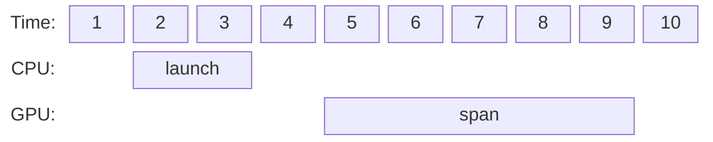

<style type="text/css" rel="stylesheet">
body {
    counter-reset: h2
}
h1 {
  counter-reset: h2;
}
h2 {
  counter-reset: h3;
}
h2::before {
  counter-increment: h2;
  content: counter(h2) ". ";
}
h3::before {
  counter-increment: h3;
  content: counter(h2) "." counter(h3) ". ";
}
</style>

# Probing Performance Profiling Implementation

This document details Probing's performance profiling implementation. For Probing's overall architecture design, please refer to [Overall Architecture](./architecture.md).

When optimizing systems, Benchmark and Profiling are two very important methods. The former refers to methods for testing end-to-end performance of the entire system or end-to-end performance of a subsystem, which can quickly form a feedback loop: code optimization --> Benchmark --> code optimization. This is also the main workflow for most engineers doing performance optimization. However, pure Benchmark workflows easily fall into situations where significant effort is invested in optimizing code, but performance never improves. At this point, the optimizations being invested are no longer the core bottleneck of the entire system, so they cannot bring much improvement to overall system performance. To locate system performance problems and find bottlenecks that need optimization, Profiling is required.

## Profiling Methodology

In daily work, we encounter many profiling tools, such as perf built into the Linux kernel, Intel's vtune, and torch's torch.profiler. These tools can be divided into three categories based on their underlying principles: Instrumentation, Sampling, and Performance Counter.

### Instrumentation Method

When testing code performance, a commonly used method is to directly insert timing code in the code:

```python
def foo():
  start = time.time()
  do something
  end = time.time()

  print("duration = ", end - start)
```

In addition to recording time, this manual code insertion can also record branch and loop conditions, memory allocation situations, and other information of interest when analyzing performance. If this process can be automated, inserting relevant timing for every piece of code executed, we can profile the entire application from a global perspective. This is automatic Instrumentation technology. For C/C++ code, this instrumentation requires compiler support, such as GCC's profiling-related options:
```bash 
gcc a.c -g -pg
```

With Instrumentation, compilers can also implement code coverage, AddressSanitizer, StackProtector, and other features. In addition to directly affecting binary code generation at compile time, modifications can also be made in the linker/loader. For example, most memory profilers track memory allocation behavior by replacing malloc/free functions in libc.

#### Python Code Instrumentation

For Python, the most common instrumentation method is using Decorators:

```python
def my_decorator(func):
  def wrapper(*args, **kwargs):
    start = time.time()
    ret = func(*args, **kwargs)
    end = time.time()
    print("duration of {}: {}", func, end - start)
    return ret
  return wrapper
```

When using `my_decorator`:
```python
@my_decorator
def foo():
  pass
```

Will be automatically expanded to:
```python
def foo():
  pass
foo = my_decorator(foo)
```

Python also supports decorators with parameters, which won't be further expanded here. Decorator syntax greatly simplifies the development cost of instrumentation in Python and is easy to control in code. Working together with decorator syntax is the `with` syntax, which defines a semantic scope that can be used to control the logic of instrumentation code:

```python
def my_decorator(func):
  def wrapper(*args, **kwargs):
    enabled = get_enable()
    if enabled:
      start = time.time()
    ret = func(*args, **kwargs)
    if enabled:
      end = time.time()
      print("duration of {}: {}", func, end - start)
    return ret
  return wrapper

class MyContext:
  def __enter__(self):
    set_enable()
  def __exit__(self):
    set_disable()
```

At this point, `MyContext` can be used to control instrumentation code behavior:
```python
foo()   # Will not execute instrumentation code
with MyContext():
  foo() # Will print instrumentation timing

foo()   # Will not execute instrumentation code
```

#### Python Interpreter Instrumentation

In addition to instrumentation operations in code, Python also supports instrumentation operations at the interpreter level. The Python interpreter supports user-defined trace functions:

```C
struct _frame {
    PyObject_HEAD
    PyFrameObject *f_back;      /* previous frame, or NULL */
    struct _PyInterpreterFrame *f_frame; /* points to the frame data */
==> PyObject *f_trace;          /* Trace function */
    int f_lineno;               /* Current line number. Only valid if non-zero */
    char f_trace_lines;         /* Emit per-line trace events? */
    char f_trace_opcodes;       /* Emit per-opcode trace events? */
    PyObject *f_extra_locals;   /* Dict for locals set by users using f_locals, could be NULL */
    ...
};
```

When executing Python code, this `f_trace` function can be used to trace interpreter internal execution. There are 5 types of events that will be forwarded to the trace function:
- call: Execute function call.
- line: Execute a line of code.
- return: Function returns.
- exception: An exception occurs.
- opcode: Execute a bytecode instruction.

Using the `trace` function, Python debuggers, profilers, etc. can be implemented. If we need to implement a distributed debugger, we can develop an RPC-controlled trace function. Additionally, Python code can introspectively obtain bytecode for each function and decompile and instrument these bytecodes. Methods for bytecode decompilation and instrumentation will not be expanded here.

#### Torch Framework Instrumentation

Torch framework's dispatch mechanism reserves some hook interfaces that can capture operator calls through the `torch::addGlobalCallback` interface. These hooks are passed a `torch::RecordFunction` structure, through which call context can be obtained, including name, inputs, etc. However, the overhead of recording these call information is high and needs to be well controlled. Torch also provides the `c10::ThreadLocalDebugInfo` interface for tracking some information throughout the forward and backward processes.

Main functions using `addGlobalCallback` for tracing in PyTorch include:
1. Kineto Profiler, the main implementation of Torch Profiler: torch/csrc/autograd/profiler_kineto.cpp
2. Execution Trace Observer, used to export computation graphs for underlying facility analysis and simulation: torch/csrc/profiler/standalone/execution_trace_observer.cpp

### Sampling Method

Instrumentation methods can obtain accurate execution timelines and output timelines. However, instrumentation requires invading target code and brings additional runtime overhead, making it difficult to use directly in online production tasks.

Sampling methods can well avoid invasion of target code while keeping performance overhead at a reasonable level. There are two common sampling methods:

#### Pprof Method

The Pprof method was first seen in Google's gperftools. Its implementation principle is to set a timer based on the `setitimer` method[^setitimer]. The prototype of the `setitimer` method is as follows:

```C
int setitimer(int which, const struct itimerval *new_value,
              struct itimerval *old_value);
```

Where `which` has three values:

- **ITIMER_REAL**: When timing completes, triggers **SIGALRM** signal.
- **ITIMER_VIRTUAL**: When timing completes, triggers **SIGALRM** signal, but only times when process is active.
- **ITIMER_PROF**: When timing completes, triggers **SIGPROF** signal.

The **SIGPROF** signal randomly selects a thread, interrupts its execution, and runs the signal's handler on its execution stack. Generally, threads that consume more CPU have a higher probability of being selected. In the signal's handler, the call stack of the interrupted thread can be obtained through backtrace. After analyzing the stack through libunwind, a sampling can be completed. By combining multiple sampling results, a flame graph of the current process can be drawn.

#### PMU Method

Linux provides perf-related interfaces[^9] that expose hardware PMU (Performance Monitoring Unit) sampling capabilities to developers:

```C
#include <linux/perf_event.h>    /* Definition of PERF_* constants */
#include <linux/hw_breakpoint.h> /* Definition of HW_* constants */
#include <sys/syscall.h>         /* Definition of SYS_* constants */
#include <unistd.h>

int syscall(SYS_perf_event_open, struct perf_event_attr *attr,
            pid_t pid, int cpu, int group_fd, unsigned long flags);
```

Since glibc does not provide a wrapper, system calls need to be made directly through syscall. `perf_event_attr` is used to control PMU sampling:
```C
struct perf_event_attr {
    __u32 type;                 /* Type of event */
    __u32 size;                 /* Size of attribute structure */
    __u64 config;               /* Type-specific configuration */

    union {
        __u64 sample_period;    /* Period of sampling */
        __u64 sample_freq;      /* Frequency of sampling */
    };

    __u64 sample_type;  /* Specifies values included in sample */
    __u64 read_format;  /* Specifies values returned in read */

    ...
    union {
        __u32 wakeup_events;    /* wakeup every n events */
        __u32 wakeup_watermark; /* bytes before wakeup */
    };
    ...
};
```

Key field descriptions:
- type: Used to define event type
  - `PERF_TYPE_HARDWARE` Hardware sampling
  - `PERF_TYPE_SOFTWARE` Software sampling
- config: Used to configure events
  - `PERF_COUNT_HW_CPU_CYCLES` Sample by clock cycles
  - `PERF_COUNT_HW_INSTRUCTIONS` Sample by instruction count
- sample_type: Used to specify information included in sampling events
  - `PERF_SAMPLE_IP` Record IP pointer
  - `PERF_SAMPLE_TIME` Record timestamp
  - `PERF_SAMPLE_STACK_USER` Record user-space call stack
  - `PERF_SAMPLE_CALLCHAIN` Record call stack

Compared to the `setitimer` method, the PMU method can provide higher timing precision, and sampling is completely done by hardware with lower overhead. However, the PMU method depends on specific hardware implementation and requires processes to have CAP_PERFMON permissions (Linux 5.8+) or CAP_SYS_ADMIN permissions. Also, PMU cannot obtain richer information through handlers like SIGPROF.

#### GPU Sampling Techniques

CUDA supports sampling PC pointers (program counter) on devices. Each SM (Streaming Multiprocessor) randomly selects a warp at fixed time intervals to record its scheduling state and PC pointer. CUDA also provides methods to associate PC pointers with SASS code for users to obtain function IDs.

Starting from CUDA 12.6, CUPTI (CUDA Profiling Toolkit Interface) introduced a new performance monitors (PM) interface[^cupti_pm]. Based on this interface, the following can be obtained:
- GR Active: The percentage of cycles the compute engine is active.
- Tensor Active / FP16 Active: The ratio of cycles the SM tensor pipes or FP16x2 pipes were active issuing tensor instructions to the number of cycles in the sample period as a percentage.
- DRAM Read Bandwidth: The ratio of cycles the DRAM interface was active reading data to the elapsed cycles in the same period as a percentage.
- PCIe Read Throughput: The ratio of bytes received on the PCIe interface to the maximum number of bytes receivable in the sample period as a percentage.
- NVLink bytes received: The ratio of bytes received on the NVLink interface to the maximum number of bytes receivable in the sample period as a percentage.

For the complete list, please refer to Nvidia's official documentation.

### Performance Counter Method

From the introduction of Instrumentation and Sampling methods, we can see a trend: sampling-based methods have received increasing development and hardware support due to their low intrusiveness and wide applicability. In addition to conventional IP pointer sampling, memory operation counters, PCIe operation counters, etc. also provide a lot of useful information for diagnosing performance problems. However, the implementation of performance counter methods is not limited to hardware implementation; software layers can also provide diagnostic information through performance counters. Common hardware and software counters are briefly listed here:

#### Hardware Counters

In a heterogeneous training hardware system, different hardware components have their own counters. Common hardware counters are listed below:

- CPU[^1][^2]
  - Instruction counters: `instructions` instruction counter and `cycles` clock counter, etc.
  - Cache: `cache-misses` L1, L2, L3 cache miss counts and `cache-references` cache access counts, etc.
  - Branch: `branch-instructions` branch instruction count and `branch-misses` branch prediction failure count, etc.
- RDMA[^6]
  - Basic statistics: `port_rcv_packets` received packet count and `port_xmit_packets` (sent packet count, etc.
  - Data: `port_rcv_data` received data volume and `port_xmit_data` sent data volume.
  - Congestion control: `np_cnp_sent`, etc.

#### Software Counters

At various levels of the entire software stack, there are also counters of various sizes:

- OS level:
  - /proc/<pid>/stat, CPU, context switches, system calls, and other statistics.
  - /proc/<pid>/statm, process memory usage.
- Framework level:
  - NCCL Counter[^7]
  - PyTorch Flight Recorder[^8]

#### GPU Performance Counters

PMU on GPU is divided into two parts: Core PMU and Uncore PMU, used to monitor performance metrics on Core and outside Core respectively:

- Core performance counters[^nsyscomp]:
  - Computation: `sm_inst_executed` executed instruction count, `sm_inst_executed_atomics` executed atomic instruction count.
  - Memory access: `sm_inst_executed_generic_loads` memory load instruction count and `sm_inst_executed_generic_stores` memory save instruction count.
- Uncore performance counters[^uncore]
  - SCF PMU: Monitors system-level cache events, CPU traffic, and strongly ordered (SO) PCIe write traffic to local/remote memory.
  - NVLink-C2C0 PMU: Monitors incoming traffic from GPUs/CPUs connected through NVLink-C2C (chip-to-chip) interconnect.
  - NVLink-C2C1 PMU: Monitors incoming traffic from GPUs connected through NVLink-C2C (chip-to-chip) interconnect.
  - CNVLink PMU: Monitors traffic from GPUs and PCIe devices on remote slots to local memory.
  - PCIE PMU: Monitors all read/write traffic from PCIe root port to local/remote memory.

#### Sampling GPU Performance Counters

A common usage of performance counters is to capture performance counter values at the start and end of a span, and use the difference to determine how much network throughput or computation the code within the span generated. However, for heterogeneous computing scenarios like GPU, sampling and statistics of performance counters often need to consider the synchronization relationship between GPU Stream execution and CPU. That is, asynchronous sampling must be performed on GPU Stream to obtain true values over a period of time. As shown in the figure below, although computation is initiated by CPU at time `2-3`, obtaining hardware performance counters needs to be at time `5-9`.



Therefore, reading GPU hardware registers must be completed on the GPU device to better satisfy Stream asynchronous semantics. How to read performance counters on GPU and synchronize data to the CPU side will be discussed in another article.

## Challenges and Coping Strategies for Distributed Training Profiling

Existing Profiling tools can better solve single-machine performance analysis problems, but in distributed training scenarios, they face new challenges:

1. **Dramatic Changes in Performance Characteristics**
   - When cluster scale expands, training task performance characteristics will significantly change. For example:
     - 3D parallel partitioning strategies are affected by cluster scale and parallel parameters. Single-machine Profiling has difficulty capturing key metrics of all participating roles.
     - In large-scale clusters, collective communication may cause latency spikes and bandwidth utilization drops. Single-machine Profiling tools have difficulty accurately reflecting these phenomena.

2. **Complexity of Data Statistics and Parsing**
   - Single-machine Profiling usually relies on single samples to draw relatively certain conclusions, while distributed environments rely more on massive statistical data, greatly increasing accuracy requirements for results and complexity of data parsing.

3. **Cross-Node Collaborative Debugging Requirements**
   - In distributed environments, nodes must achieve precise coordination, performing real-time and in-depth analysis of collaborative behaviors between different roles, which places higher demands on Profiling tools.
   - Timeline is extremely helpful for single-machine system performance analysis, but for distributed training problems, timeline methods face two issues:
     1. Data volume and analysis difficulty: In a 1000-node cluster, Timeline data volume may exceed TB level, making storage and visualization infeasible, and 1000 timelines are also difficult to analyze.
     2. Time precision issues: Distributed node time synchronization has precision problems, and millisecond-level time synchronization errors can mask real communication problems.

**Technical Approaches to Address These Challenges:**

1. **Sampling-Based Low-Intrusion Profiling**
   - By flexibly adjusting sampling rates, Profiling needs from single-machine debugging to large-scale distributed production tasks can be met while ensuring overall system performance.

2. **Hybrid Approach of Instrumentation and Sampling**
   - For long-running, low-frequency tasks, mix Instrumentation methods on top of sampling, ensuring accuracy of key data while providing sufficient context information to assist fine-tuning.

3. **Combination of Sampling and Performance Modeling**
   - Since pure Sampling methods are insufficient to show complete execution timelines, it's necessary to introduce performance modeling:
     - Model theoretical FLOPS (Floating-Point Operations Per Second), memory throughput, and communication volume of training tasks.
     - Combine modeling results with sampling data to quantify computing utilization and bandwidth utilization of each model layer, comprehensively evaluating potential masking phenomena between computation, communication, and memory access.

## Probing's Performance Profiling Solution

### Solution Introduction

1. Split model execution into different spans according to its Layer structure. This process can be automatically completed using Torch and Python's reflection features.
2. For each span, time it using sampling while recording span-related metadata, such as computation content within the span, inputs for this computation, etc.
3. For each span, while sampling execution time, also sample underlying hardware counters, such as NCCL communication and memory access.
4. Combine with performance modeling results to evaluate whether actual hardware throughput within each span is reasonable, and calculate computing utilization, memory bandwidth utilization, and interconnect bandwidth utilization within the span.

Probing's profiling solution essentially replaces horizontal timeline correlation analysis with vertical layered decoupling analysis:

|          | Timeline Method | Probing |
| -------- | --------------- | ------- |
| Analysis Dimension | Horizontal timeline correlation analysis | Vertical layered decoupling analysis |
| Focus | Temporal order relationships of cross-node events | Resource utilization efficiency of each abstraction layer on single node |
| Data Dependency | Requires precise global clock synchronization | Only needs relative timestamps or logical causality |
| Typical Output | Gantt charts, communication timing diagrams | Heat maps, layered utilization radar charts |
| Applicable Scenarios | Deadlock diagnosis, fine-grained communication optimization | Normalized performance monitoring, architecture-level bottleneck location |

### How to Solve Problems

#### Basic Performance Problems in Single-Machine Environment

- Locate inefficient operators:
  - Traditional difficulty: Can observe time of each operator, but cannot determine what reasonable time is or how much optimization space exists.
  - Solution:
    - Analyze MFU of each span top-down through Probing.
    - Locate fine-grained spans with lower MFU by descending from top-level spans.
- Insufficient task pipeline masking, computation and data copy not fully overlapped:
  - Traditional difficulty: Timeline tools can observe event overlap but cannot quantify masking efficiency.
  - Solution:
    - Define ideal execution time for pipeline stages (e.g., T_pipeline = max(T_load, T_comp, T_save)).
    - Calculate actual efficiency (efficiency = T_pipeline ideal value / T_pipeline actual value), identify tail stages.

#### Distributed Tuning in Small-Scale Clusters

- Communication-computation masking failure:
  - Traditional difficulty: Communication time is affected by multiple factors such as network topology, message size, protocol type, making it difficult to locate root cause.
  - Solution:
    - Obtain execution time of a span through Probing.
    - Calculate ideal computation time and ideal communication time through performance modeling.
    - Calculate communication time exposure ratio = (T_span - max(T_comp, T_c2c))/T_c2c.
- Collective operation delay caused by load imbalance:
  - Traditional difficulty: Cannot determine when each node enters collective communication semantics.
  - Solution:
    - Track time from start to end of each collective communication.
    - Group nodes according to node roles, compare collective communication time overhead within groups.

#### Unique Problems in Ultra-Large-Scale Training

- Training hangs:
  - Traditional difficulty: Difficult to locate which process causes hang among thousands of processes.
  - Solution:
    - View call stack of each process through probing.
    - View internal counters of collective communication library within each process through probing.
- Slow node problem:
  - Traditional difficulty: Lack of means to locate which process is slow.
  - Solution:
    - Draw performance heatmap with probing, locate slow nodes on heatmap.
    - Locate nodes frequently waited for by other nodes through communication library's performance counters.

## References

[^1]: https://github.com/torvalds/linux/blob/master/tools/perf/Documentation/perf-intel-pt.txt
[^2]: Use `perf list` to view complete list
[^3]: [Nvidia GPU Hardware Performance Counters](https://docs.nvidia.com/gameworks/index.html#developertools/desktop/linux_graphics_debugger/lgd_perf_counters.htm)
[^nsyscomp]: [Hardware Metrics in NSight Compute](https://docs.nvidia.com/nsight-compute/ProfilingGuide/index.html#metrics-reference)
[^5]: [PMU Registers in PTX](https://docs.nvidia.com/cuda/parallel-thread-execution/index.html#special-registers-pm0-pm7)
[^6]: [RDMA Network Card Hardware Counters](https://enterprise-support.nvidia.com/s/article/understanding-mlx5-linux-counters-and-status-parameters)
[^7]: https://github.com/NVIDIA/nccl/blob/master/src/include/nvtx3/nvtxDetail/nvtxExtImplCounters_v1.h
[^8]: https://pytorch.org/tutorials/prototype/flight_recorder_tutorial.html#enabling-flight-recorder
[^9]: https://man7.org/linux/man-pages/man2/perf_event_open.2.html
[^setitimer]: https://linux.die.net/man/2/setitimer
[^cupti_pm]: https://docs.nvidia.com/cupti/main/main.html#cupti-pm-sampling-api
[^nvpmu]: https://docs.nvidia.com/grace-perf-tuning-guide/measuring-performance.html#grace-coresight-system-pmu-units
[^uncore]: https://github.com/torvalds/linux/blob/master/Documentation/admin-guide/perf/nvidia-pmu.rst
