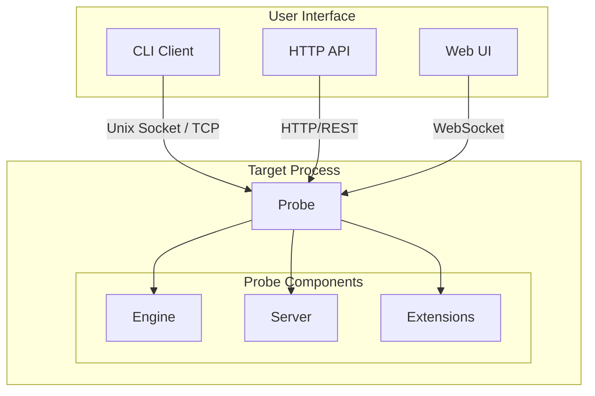
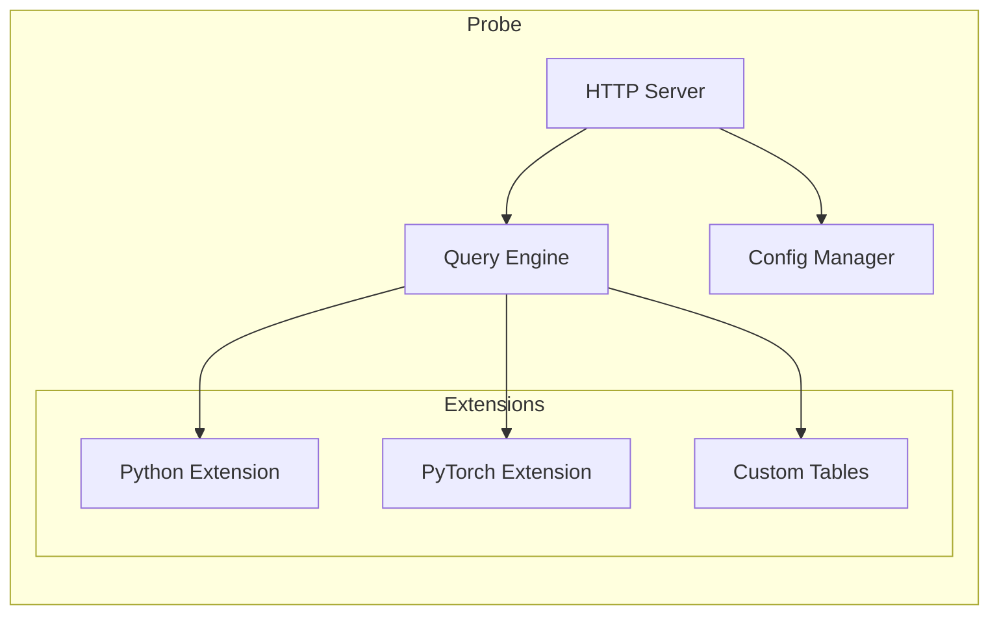
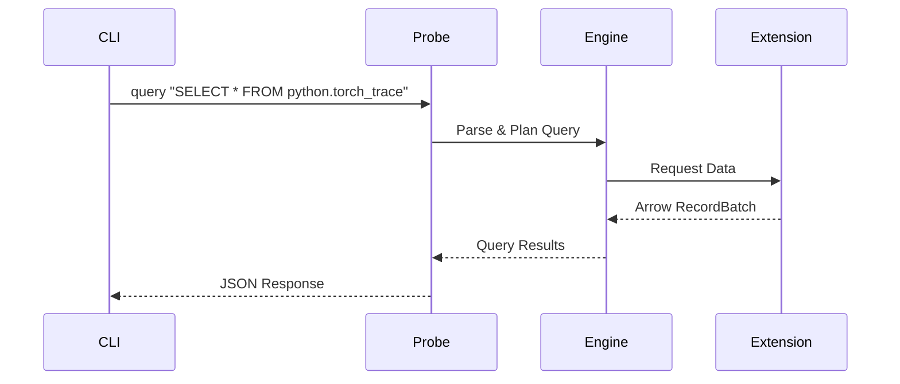

# System Architecture

Probing is designed as a simple two-layer structure to minimize complexity and deployment difficulty.

## High-Level Architecture



## Components

### 1. Probe

Injected into target processes to gain full access to all resources:

- Python interpreter access
- File system access
- Memory inspection
- Network capabilities

The probe runs an embedded HTTP server that listens on:

- **Unix domain socket** - For local connections (default)
- **TCP port** - For remote connections

### 2. CLI

Command-line interface for controlling probes:

- Process discovery and listing
- Probe injection and management
- Query execution
- Code evaluation

Communication happens via HTTP protocol over Unix domain sockets (local) or TCP (remote).

### 3. HTTP API

RESTful API for programmatic access:

- All CLI commands available as endpoints
- WebSocket support for real-time data
- Integration with monitoring tools

## Probe Internal Architecture



### Engine

Core data storage and processing:

- **DataFusion** - SQL query engine
- **Arrow** - Columnar data format
- Time-series data storage
- Configuration management

### Server

HTTP server handling:

- Request routing
- Authentication (optional)
- WebSocket connections
- Response formatting

### Extensions

Pluggable data providers:

- **Python Extension** - Backtrace, variables
- **PyTorch Extension** - Torch traces, memory
- **Custom Tables** - User-defined data sources

## Data Flow



## Communication Protocol

### Local Connection

```
probing -t <pid> query "..."
         |
         v
    Unix Socket: /tmp/probing-<pid>.sock
         |
         v
    HTTP Request: POST /query
```

### Remote Connection

```
probing -t host:port query "..."
         |
         v
    TCP Connection: host:port
         |
         v
    HTTP Request: POST /query
```

## Security Considerations

- **Local mode**: Unix socket permissions (process owner only)
- **Remote mode**: Optional authentication
- **Network**: Support for TLS encryption

## Performance Characteristics

| Aspect | Target |
|--------|--------|
| Overhead | < 5% in typical workloads |
| Memory | < 50MB additional |
| Latency | < 10ms for queries |
| Throughput | 1000+ queries/sec |
