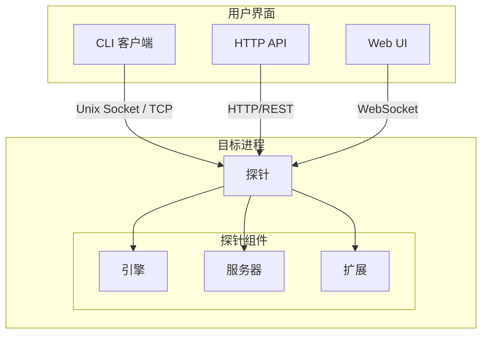
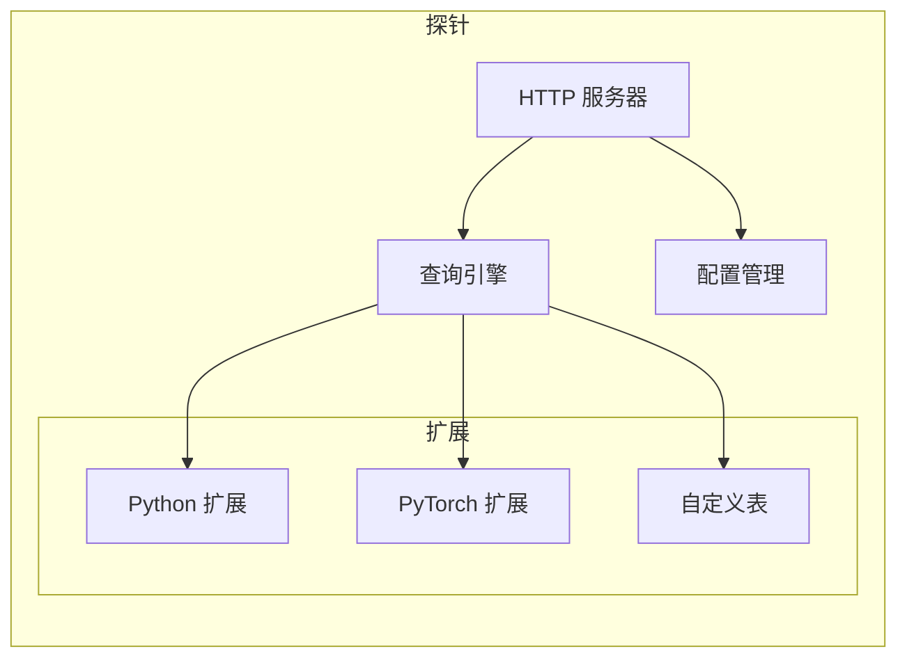
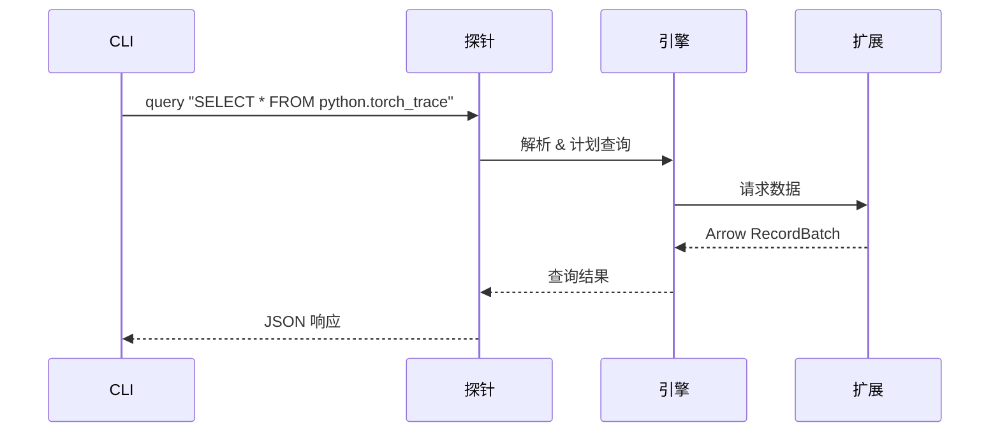

# 系统架构

Probing 采用简洁的两层架构设计，以最小化复杂性和部署难度。

## 高层架构



## 组件

### 1. 探针 (Probe)

注入到目标进程中，获得对所有资源的完全访问权限：

- Python 解释器访问
- 文件系统访问
- 内存检查
- 网络能力

探针运行一个嵌入式 HTTP 服务器，监听在：

- **Unix 域套接字** - 用于本地连接（默认）
- **TCP 端口** - 用于远程连接

### 2. CLI

用于控制探针的命令行界面：

- 进程发现和列表
- 探针注入和管理
- 查询执行
- 代码执行

通过 HTTP 协议在 Unix 域套接字（本地）或 TCP（远程）上通信。

### 3. HTTP API

用于编程访问的 RESTful API：

- 所有 CLI 命令都可作为端点使用
- WebSocket 支持实时数据
- 与监控工具集成

## 探针内部架构



### 引擎

核心数据存储和处理：

- **DataFusion** - SQL 查询引擎
- **Arrow** - 列式数据格式
- 时间序列数据存储
- 配置管理

### 服务器

HTTP 服务器处理：

- 请求路由
- 认证（可选）
- WebSocket 连接
- 响应格式化

### 扩展

可插拔的数据提供者：

- **Python 扩展** - 堆栈跟踪、变量
- **PyTorch 扩展** - Torch 跟踪、内存
- **自定义表** - 用户定义的数据源

## 数据流



## 通信协议

### 本地连接

```
probing -t <pid> query "..."
         |
         v
    Unix Socket: /tmp/probing-<pid>.sock
         |
         v
    HTTP 请求: POST /query
```

### 远程连接

```
probing -t host:port query "..."
         |
         v
    TCP 连接: host:port
         |
         v
    HTTP 请求: POST /query
```

## 安全考虑

- **本地模式**: Unix 套接字权限（仅进程所有者）
- **远程模式**: 可选认证
- **网络**: 支持 TLS 加密

## 性能特征

| 方面 | 目标 |
|------|------|
| 开销 | 典型工作负载 < 5% |
| 内存 | 额外 < 50MB |
| 延迟 | 查询 < 10ms |
| 吞吐量 | 1000+ 查询/秒 |
