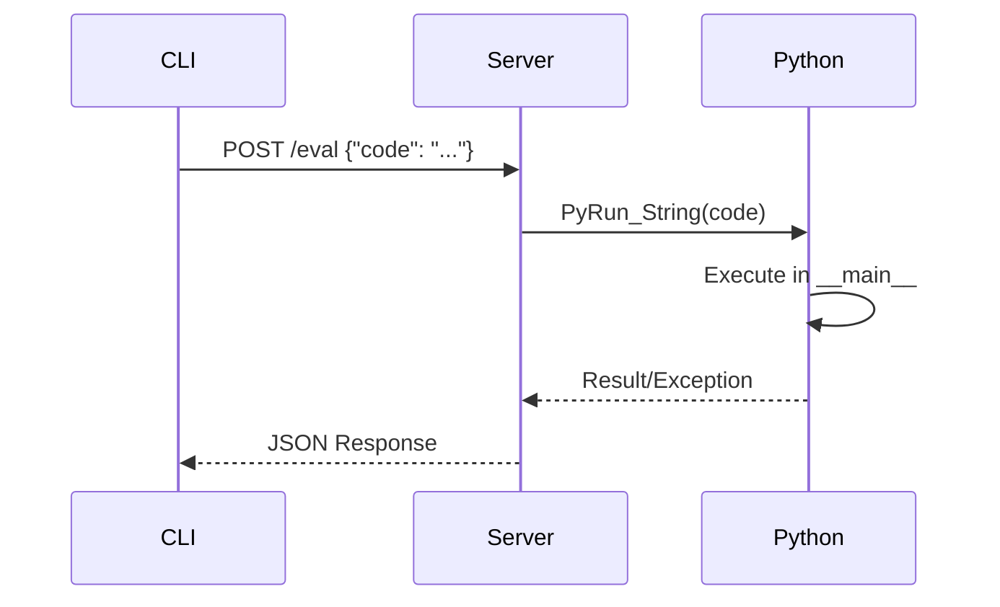

# Debugging Architecture

Probing provides powerful debugging capabilities through code injection and stack analysis.

## Overview

The debugging subsystem enables:

- Live code execution in target processes
- Stack trace capture with variable inspection
- Interactive REPL sessions
- Remote debugging support

## Code Execution

### Eval Command

Execute arbitrary Python code in the target process context:

```bash
probing $ENDPOINT eval "print(model.state_dict().keys())"
```

### Execution Flow



### Execution Context

Code executes in the main module's global namespace:

- Access to all imported modules
- Access to global variables
- Can modify state directly

### Safety Considerations

- Code runs with full privileges
- No sandboxing (by design)
- Use with appropriate access controls

## Stack Analysis

### Backtrace Capture

Captures current execution stack:

```bash
probing $ENDPOINT backtrace
```

### Frame Information

Each stack frame includes:

| Field | Description |
|-------|-------------|
| func | Function name |
| file | Source file path |
| lineno | Line number |
| depth | Stack depth (0 = innermost) |
| frame_type | Python or Native |
| locals | Local variables (optional) |

### Query Stack

```sql
SELECT func, file, lineno, depth
FROM python.backtrace
ORDER BY depth;
```

## Interactive REPL

### Starting REPL

```bash
probing -t <pid> repl
```

### REPL Features

- Tab completion
- Multi-line input
- History support
- Exception display

### Example Session

```python
>>> import torch
>>> model = get_model()
>>> model.training
True
>>> torch.cuda.memory_allocated() / 1024**3
2.5
```

## Remote Debugging

### Setup

```bash
# On target machine
PROBING_PORT=8080 python train.py

# From remote machine
probing -t host:8080 eval "..."
```

### Security

- Authentication via tokens
- TLS encryption support
- IP-based access control

## Debugging Patterns

### Finding Hangs

```bash
# Capture stack
probing $ENDPOINT backtrace

# Check where execution is blocked
probing $ENDPOINT query "
SELECT func, file, lineno
FROM python.backtrace
WHERE depth < 5"
```

### Inspecting State

```bash
# Check model state
probing $ENDPOINT eval "
for name, param in model.named_parameters():
    print(f'{name}: {param.shape}')"
```

### Modifying Behavior

```bash
# Change learning rate
probing $ENDPOINT eval "
optimizer.param_groups[0]['lr'] = 0.0001"

# Force checkpoint
probing $ENDPOINT eval "
trainer.save_checkpoint('debug_checkpoint.pt')"
```

## Thread Debugging

### List Threads

```bash
probing $ENDPOINT eval "
import threading
for t in threading.enumerate():
    print(f'{t.name}: alive={t.is_alive()}')"
```

### Main Thread Focus

Backtrace captures the main thread by default. For other threads:

```bash
probing $ENDPOINT eval "
import sys, traceback
for thread_id, frame in sys._current_frames().items():
    print(f'Thread {thread_id}:')
    traceback.print_stack(frame)"
```

## Integration with IDEs

### VS Code

The HTTP API can be used for IDE integration:

```json
{
  "type": "probing",
  "request": "attach",
  "endpoint": "localhost:8080"
}
```

### Jupyter

```python
from probing import connect

probe = connect(pid=12345)
probe.eval("print(globals().keys())")
```
