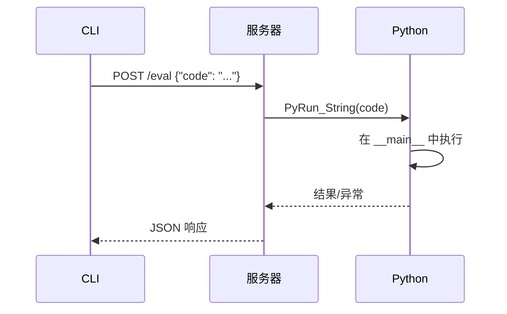

# 调试架构

Probing 通过代码注入和堆栈分析提供强大的调试能力。

## 概览

调试子系统支持：

- 在目标进程中实时执行代码
- 带变量检查的堆栈跟踪捕获
- 交互式 REPL 会话
- 远程调试支持

## 代码执行

### Eval 命令

在目标进程上下文中执行任意 Python 代码：

```bash
probing $ENDPOINT eval "print(model.state_dict().keys())"
```

### 执行流程



### 执行上下文

代码在主模块的全局命名空间中执行：

- 访问所有已导入的模块
- 访问全局变量
- 可以直接修改状态

### 安全考虑

- 代码以完全权限运行
- 无沙箱（设计如此）
- 使用适当的访问控制

## 堆栈分析

### 堆栈跟踪捕获

捕获当前执行堆栈：

```bash
probing $ENDPOINT backtrace
```

### 帧信息

每个堆栈帧包括：

| 字段 | 描述 |
|------|------|
| func | 函数名 |
| file | 源文件路径 |
| lineno | 行号 |
| depth | 堆栈深度（0 = 最内层）|
| frame_type | Python 或 Native |
| locals | 局部变量（可选）|

### 查询堆栈

```sql
SELECT func, file, lineno, depth
FROM python.backtrace
ORDER BY depth;
```

## 交互式 REPL

### 启动 REPL

```bash
probing -t <pid> repl
```

### REPL 功能

- Tab 补全
- 多行输入
- 历史记录支持
- 异常显示

### 示例会话

```python
>>> import torch
>>> model = get_model()
>>> model.training
True
>>> torch.cuda.memory_allocated() / 1024**3
2.5
```

## 远程调试

### 设置

```bash
# 在目标机器上
PROBING_PORT=8080 python train.py

# 从远程机器
probing -t host:8080 eval "..."
```

### 安全

- 通过令牌认证
- 支持 TLS 加密
- 基于 IP 的访问控制

## 调试模式

### 查找卡住位置

```bash
# 捕获堆栈
probing $ENDPOINT backtrace

# 检查执行阻塞在哪里
probing $ENDPOINT query "
SELECT func, file, lineno
FROM python.backtrace
WHERE depth < 5"
```

### 检查状态

```bash
# 检查模型状态
probing $ENDPOINT eval "
for name, param in model.named_parameters():
    print(f'{name}: {param.shape}')"
```

### 修改行为

```bash
# 修改学习率
probing $ENDPOINT eval "
optimizer.param_groups[0]['lr'] = 0.0001"

# 强制保存检查点
probing $ENDPOINT eval "
trainer.save_checkpoint('debug_checkpoint.pt')"
```

## 线程调试

### 列出线程

```bash
probing $ENDPOINT eval "
import threading
for t in threading.enumerate():
    print(f'{t.name}: alive={t.is_alive()}')"
```

### 主线程焦点

默认情况下，backtrace 捕获主线程。对于其他线程：

```bash
probing $ENDPOINT eval "
import sys, traceback
for thread_id, frame in sys._current_frames().items():
    print(f'线程 {thread_id}:')
    traceback.print_stack(frame)"
```
