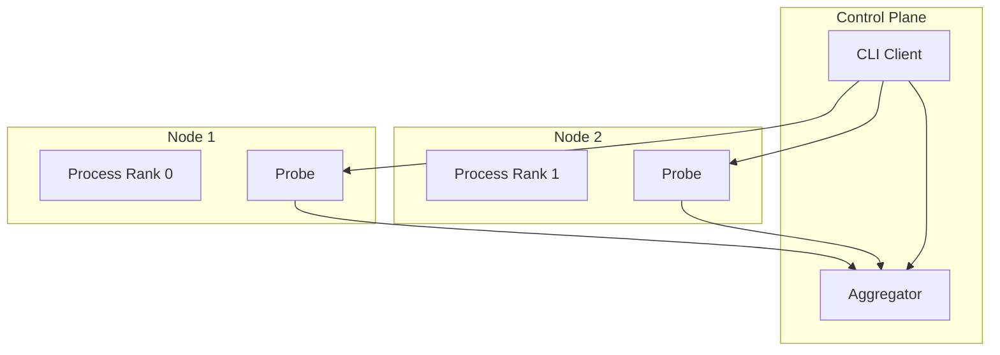

# Distributed Architecture

Probing supports monitoring and debugging distributed AI workloads across multiple nodes.

## Overview

Distributed training introduces challenges:

- Multiple processes across nodes
- Communication between ranks
- Synchronized debugging needs
- Cross-node data correlation

Probing addresses these through a distributed architecture.

## Architecture



## Process Discovery

### Local Discovery

```bash
# List all probing-enabled processes on local machine
probing list
```

### Remote Discovery

```bash
# Connect to remote node
probing -t node1:8080 list
probing -t node2:8080 list
```

### Cluster View

```bash
# Aggregate view across cluster
probing cluster list
```

## Cross-Node Queries

### Query Single Node

```bash
probing -t node1:8080 query "
SELECT * FROM python.torch_trace
WHERE step = (SELECT MAX(step) FROM python.torch_trace)"
```

### Query All Nodes

```bash
# Federated query (future feature)
probing cluster query "
SELECT node, rank, step, loss
FROM python.training_metrics
ORDER BY step"
```

## Synchronized Debugging

### Capture All Stacks

```bash
# Capture stack traces from all ranks
for node in node1 node2 node3; do
    echo "=== $node ==="
    probing -t $node:8080 backtrace
done
```

### Check Distributed State

```bash
probing -t $ENDPOINT eval "
import torch.distributed as dist

if dist.is_initialized():
    print(f'Rank: {dist.get_rank()}')
    print(f'World Size: {dist.get_world_size()}')
    print(f'Backend: {dist.get_backend()}')"
```

## Communication Analysis

### NCCL Operations

```sql
-- Analyze communication patterns
SELECT
    operation,
    src_rank,
    dst_rank,
    bytes_transferred,
    duration_ms
FROM python.nccl_trace
WHERE step = (SELECT MAX(step) FROM python.nccl_trace)
ORDER BY duration_ms DESC;
```

### RDMA Flow Analysis

```bash
# RDMA-specific analysis
probing -t $ENDPOINT rdma
```

## Troubleshooting Distributed Issues

### Rank Synchronization

```bash
# Check if all ranks are at same step
for node in node1 node2 node3; do
    probing -t $node:8080 eval "print(f'Step: {trainer.current_step}')"
done
```

### Deadlock Detection

```bash
# Check for hanging collective operations
probing -t $ENDPOINT query "
SELECT func, file, lineno
FROM python.backtrace
WHERE func LIKE '%collective%' OR func LIKE '%allreduce%'"
```

### Memory Imbalance

```sql
-- Compare memory across ranks
SELECT
    rank,
    AVG(allocated) as avg_memory,
    MAX(allocated) as peak_memory
FROM python.torch_trace
GROUP BY rank;
```

## Configuration

### Enable Remote Access

```bash
# Start with TCP server
PROBING_PORT=8080 python train.py

# Or configure dynamically
probing $ENDPOINT config probing.server.port=8080
```

### Security

```bash
# Enable authentication
PROBING_AUTH_TOKEN=secret python train.py

# Connect with token
probing -t host:8080 --token secret query "..."
```

## Best Practices

### 1. Consistent Configuration

Use same configuration across all nodes:

```bash
export PROBING_PORT=8080
export PROBING_TORCH_PROFILING=on
```

### 2. Centralized Collection

For large clusters, consider aggregation:

```bash
# Export data to central location
probing -t $node query "SELECT * FROM python.torch_trace" >> /shared/traces.json
```

### 3. Timestamp Synchronization

Ensure NTP is configured for accurate cross-node timing.

### 4. Network Considerations

- Use dedicated network for probing traffic if possible
- Consider firewall rules for probing ports
- Monitor probing overhead on training network
