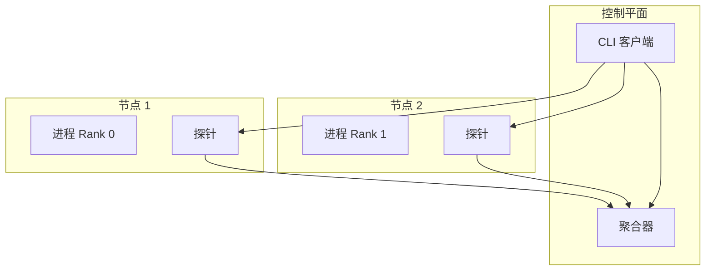

# 分布式架构

Probing 支持监控和调试跨多节点的分布式 AI 工作负载。

## 概览

分布式训练带来了挑战：

- 跨节点的多进程
- Rank 之间的通信
- 同步调试需求
- 跨节点数据关联

Probing 通过分布式架构解决这些问题。

## 架构



## 进程发现

### 本地发现

```bash
# 列出本地机器上所有启用 probing 的进程
probing list
```

### 远程发现

```bash
# 连接到远程节点
probing -t node1:8080 list
probing -t node2:8080 list
```

### 集群视图

```bash
# 跨集群的聚合视图
probing cluster list
```

## 跨节点查询

### 查询单个节点

```bash
probing -t node1:8080 query "
SELECT * FROM python.torch_trace
WHERE step = (SELECT MAX(step) FROM python.torch_trace)"
```

### 查询所有节点

```bash
# 联合查询（未来功能）
probing cluster query "
SELECT node, rank, step, loss
FROM python.training_metrics
ORDER BY step"
```

## 同步调试

### 捕获所有堆栈

```bash
# 从所有 rank 捕获堆栈跟踪
for node in node1 node2 node3; do
    echo "=== $node ==="
    probing -t $node:8080 backtrace
done
```

### 检查分布式状态

```bash
probing -t $ENDPOINT eval "
import torch.distributed as dist

if dist.is_initialized():
    print(f'Rank: {dist.get_rank()}')
    print(f'World Size: {dist.get_world_size()}')
    print(f'Backend: {dist.get_backend()}')"
```

## 通信分析

### NCCL 操作

```sql
-- 分析通信模式
SELECT
    operation,
    src_rank,
    dst_rank,
    bytes_transferred,
    duration_ms
FROM python.nccl_trace
WHERE step = (SELECT MAX(step) FROM python.nccl_trace)
ORDER BY duration_ms DESC;
```

### RDMA 流分析

```bash
# RDMA 特定分析
probing -t $ENDPOINT rdma
```

## 分布式问题排查

### Rank 同步

```bash
# 检查所有 rank 是否在相同步骤
for node in node1 node2 node3; do
    probing -t $node:8080 eval "print(f'Step: {trainer.current_step}')"
done
```

### 死锁检测

```bash
# 检查挂起的集合操作
probing -t $ENDPOINT query "
SELECT func, file, lineno
FROM python.backtrace
WHERE func LIKE '%collective%' OR func LIKE '%allreduce%'"
```

### 内存不均衡

```sql
-- 比较各 rank 的内存
SELECT
    rank,
    AVG(allocated) as avg_memory,
    MAX(allocated) as peak_memory
FROM python.torch_trace
GROUP BY rank;
```

## 配置

### 启用远程访问

```bash
# 以 TCP 服务器启动
PROBING_PORT=8080 python train.py

# 或动态配置
probing $ENDPOINT config probing.server.port=8080
```

### 安全

```bash
# 启用认证
PROBING_AUTH_TOKEN=secret python train.py

# 带令牌连接
probing -t host:8080 --token secret query "..."
```

## 最佳实践

### 1. 一致的配置

在所有节点上使用相同配置：

```bash
export PROBING_PORT=8080
export PROBING_TORCH_PROFILING=on
```

### 2. 集中收集

对于大型集群，考虑聚合：

```bash
# 导出数据到中心位置
probing -t $node query "SELECT * FROM python.torch_trace" >> /shared/traces.json
```

### 3. 时间戳同步

确保配置 NTP 以获得准确的跨节点时间。

### 4. 网络考虑

- 尽可能使用专用网络进行 probing 流量
- 考虑 probing 端口的防火墙规则
- 监控 probing 对训练网络的开销
