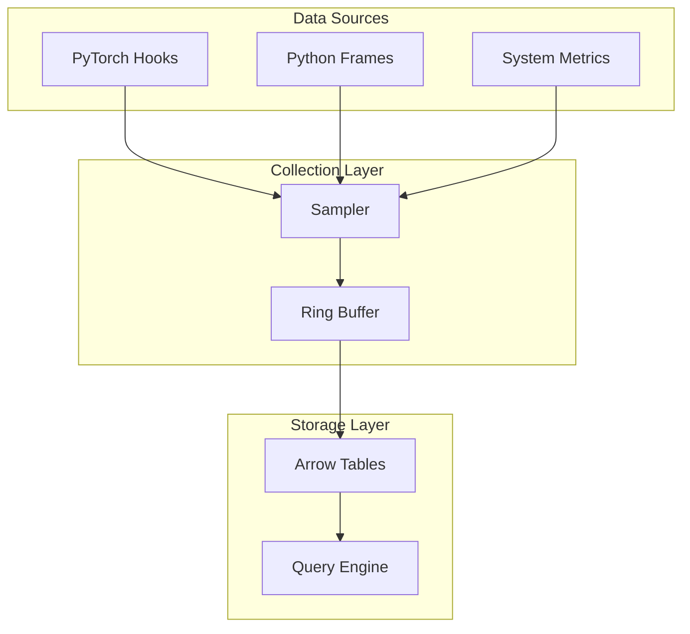

# Profiling Implementation

Probing provides comprehensive profiling capabilities for AI workloads.

## Overview

The profiling system collects performance data with minimal overhead through:

- Event-based collection
- Efficient sampling strategies
- Columnar data storage
- SQL query interface

## Data Collection Architecture



## PyTorch Profiling

### Hook Integration

Probing integrates with PyTorch's module hooks:

```python
# Forward hook
def forward_hook(module, input, output):
    record_trace(module, "forward", memory_stats())

# Backward hook
def backward_hook(module, grad_input, grad_output):
    record_trace(module, "backward", memory_stats())
```

### Collected Data

| Field | Type | Description |
|-------|------|-------------|
| step | int | Training step number |
| seq | int | Sequence within step |
| module | string | Module name |
| stage | string | forward/backward/step |
| allocated | float | GPU memory allocated (MB) |
| max_allocated | float | Peak GPU memory (MB) |
| cached | float | GPU memory cached (MB) |
| duration | float | Execution time (seconds) |

### Enable PyTorch Profiling

```bash
# Environment variable
PROBING_TORCH_PROFILING=on python train.py

# Or programmatically
import probing
probing.enable_torch_profiling()
```

## Python Stack Profiling

### Backtrace Collection

Captures Python call stack with:

- Function names
- File paths
- Line numbers
- Local variables (optional)

```python
# Stack frame data
{
    "func": "forward",
    "file": "/app/model.py",
    "lineno": 123,
    "depth": 5,
    "frame_type": "Python"
}
```

### Sampling Strategy

- **Periodic sampling**: Configurable interval (default: 100ms)
- **Event-triggered**: On specific operations
- **On-demand**: Via backtrace command

## System Metrics

### Collected Metrics

- CPU utilization
- Memory usage (RSS, VMS)
- GPU utilization
- GPU memory
- I/O statistics
- Network statistics

### Collection Interval

```bash
# Configure sampling interval
probing $ENDPOINT config probing.sample_rate=0.1  # 100ms
```

## Data Storage

### Ring Buffer

Efficient fixed-size buffer for recent data:

- Configurable size (default: 10000 records)
- Automatic eviction of old data
- Lock-free concurrent access

### Arrow Tables

Columnar format for efficient queries:

- Vectorized operations
- Memory-mapped I/O
- Compression support

## Query Interface

### Available Tables

```sql
-- List available tables
SELECT table_name FROM information_schema.tables;

-- Query torch traces
SELECT * FROM python.torch_trace WHERE step > 100;

-- Query backtraces
SELECT * FROM python.backtrace;
```

### Custom Aggregations

```sql
-- Per-module statistics
SELECT
    module,
    COUNT(*) as count,
    AVG(duration) as avg_duration,
    MAX(allocated) as peak_memory
FROM python.torch_trace
GROUP BY module;
```

## Performance Overhead

### Measurement Results

| Scenario | Overhead |
|----------|----------|
| Idle (no profiling) | < 0.1% |
| Basic profiling | < 1% |
| Full PyTorch profiling | < 5% |
| With variable capture | < 10% |

### Optimization Techniques

1. **Lazy evaluation** - Only compute metrics when queried
2. **Batched writes** - Buffer multiple records before storage
3. **Sampling** - Configurable sample rates
4. **Selective hooks** - Enable only needed data sources
