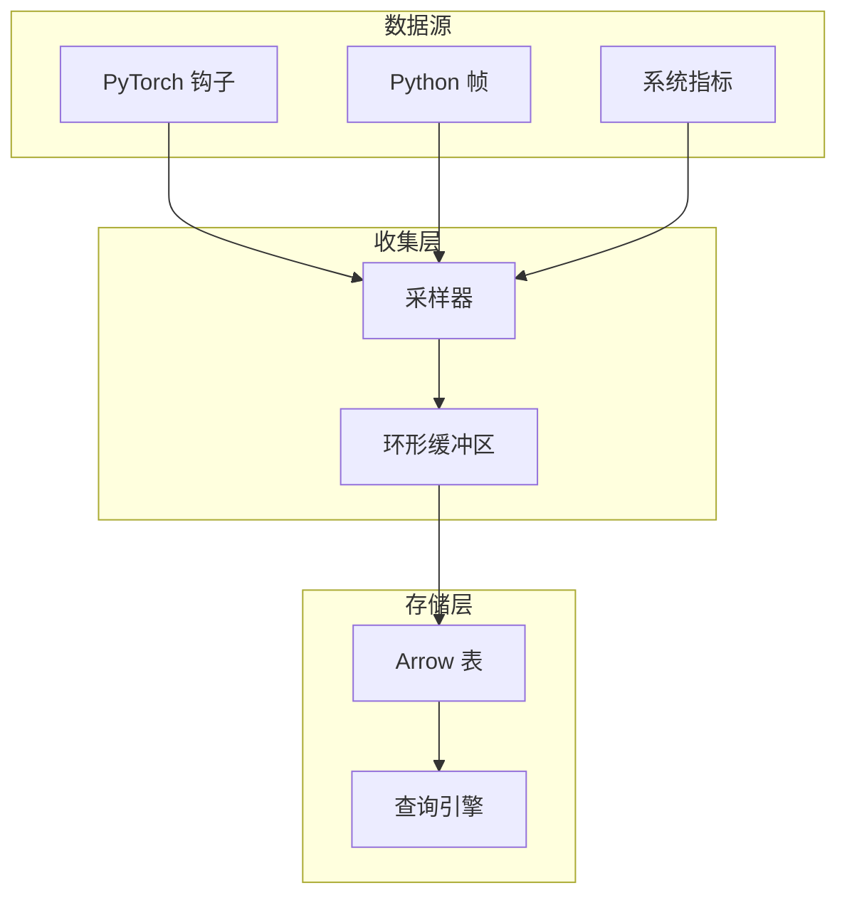

# 性能分析实现

Probing 为 AI 工作负载提供全面的性能分析能力。

## 概览

性能分析系统通过以下方式以最小开销收集性能数据：

- 基于事件的收集
- 高效的采样策略
- 列式数据存储
- SQL 查询接口

## 数据收集架构



## PyTorch 分析

### 钩子集成

Probing 与 PyTorch 的模块钩子集成：

```python
# 前向钩子
def forward_hook(module, input, output):
    record_trace(module, "forward", memory_stats())

# 反向钩子
def backward_hook(module, grad_input, grad_output):
    record_trace(module, "backward", memory_stats())
```

### 收集的数据

| 字段 | 类型 | 描述 |
|------|------|------|
| step | int | 训练步数 |
| seq | int | 步内序号 |
| module | string | 模块名 |
| stage | string | forward/backward/step |
| allocated | float | GPU 已分配内存 (MB) |
| max_allocated | float | GPU 峰值内存 (MB) |
| cached | float | GPU 缓存内存 (MB) |
| duration | float | 执行时间（秒）|

### 启用 PyTorch 分析

```bash
# 环境变量
PROBING_TORCH_PROFILING=on python train.py

# 或编程方式
import probing
probing.enable_torch_profiling()
```

## Python 堆栈分析

### 堆栈跟踪收集

捕获 Python 调用栈包括：

- 函数名
- 文件路径
- 行号
- 局部变量（可选）

```python
# 堆栈帧数据
{
    "func": "forward",
    "file": "/app/model.py",
    "lineno": 123,
    "depth": 5,
    "frame_type": "Python"
}
```

### 采样策略

- **周期采样**: 可配置间隔（默认：100ms）
- **事件触发**: 特定操作时
- **按需**: 通过 backtrace 命令

## 系统指标

### 收集的指标

- CPU 利用率
- 内存使用（RSS、VMS）
- GPU 利用率
- GPU 内存
- I/O 统计
- 网络统计

### 收集间隔

```bash
# 配置采样间隔
probing $ENDPOINT config probing.sample_rate=0.1  # 100ms
```

## 数据存储

### 环形缓冲区

高效的固定大小缓冲区用于存储最新数据：

- 可配置大小（默认：10000 条记录）
- 自动淘汰旧数据
- 无锁并发访问

### Arrow 表

用于高效查询的列式格式：

- 向量化操作
- 内存映射 I/O
- 压缩支持

## 性能开销

### 测量结果

| 场景 | 开销 |
|------|------|
| 空闲（无分析）| < 0.1% |
| 基础分析 | < 1% |
| 完整 PyTorch 分析 | < 5% |
| 带变量捕获 | < 10% |

### 优化技术

1. **延迟计算** - 仅在查询时计算指标
2. **批量写入** - 缓冲多条记录后再存储
3. **采样** - 可配置采样率
4. **选择性钩子** - 仅启用需要的数据源
